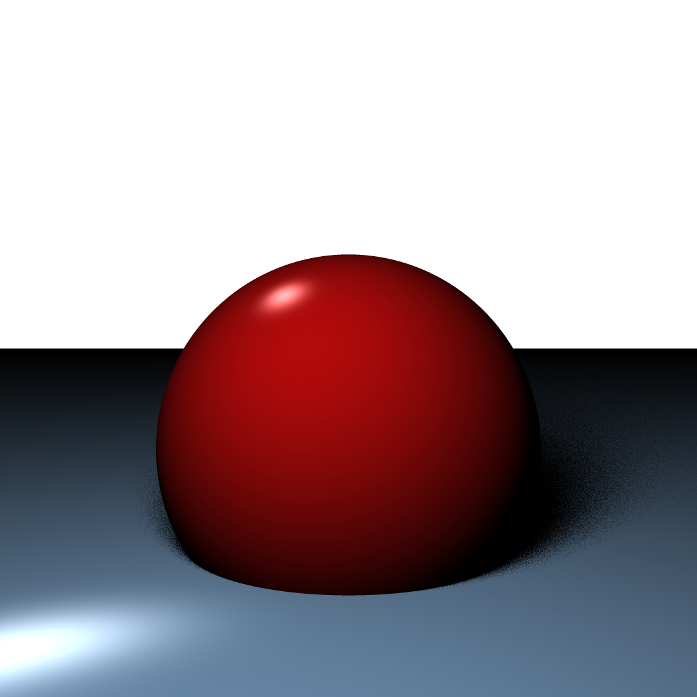
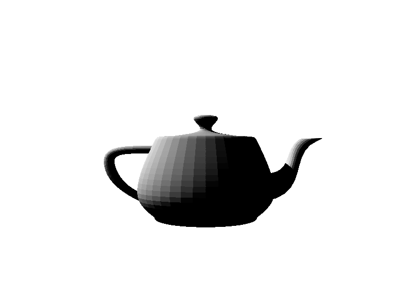
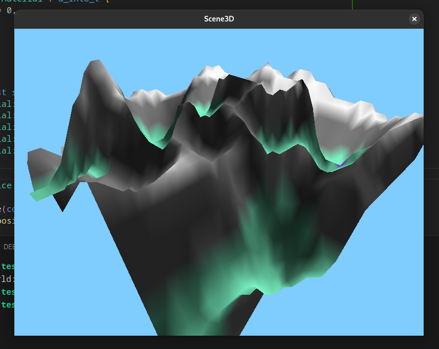
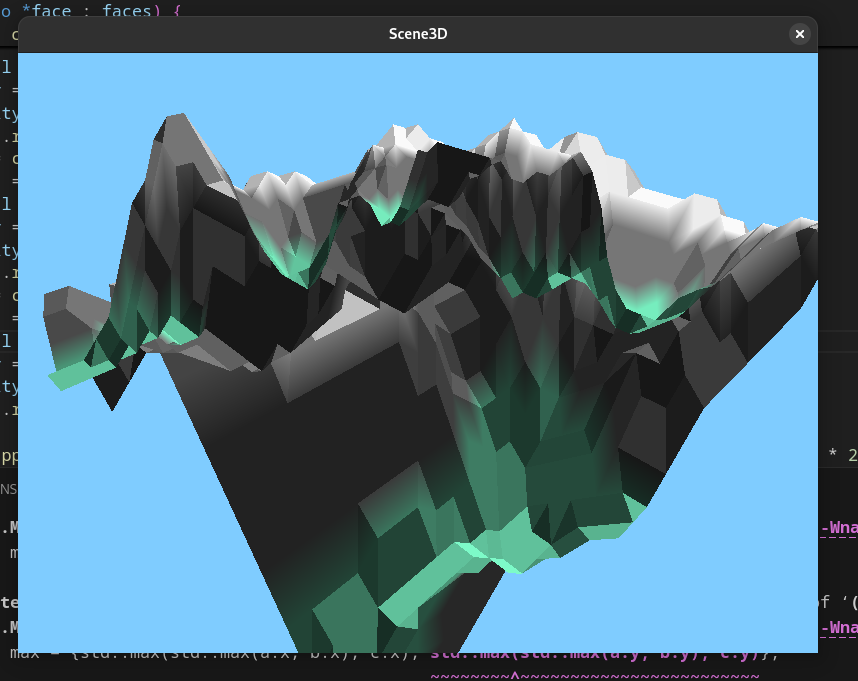
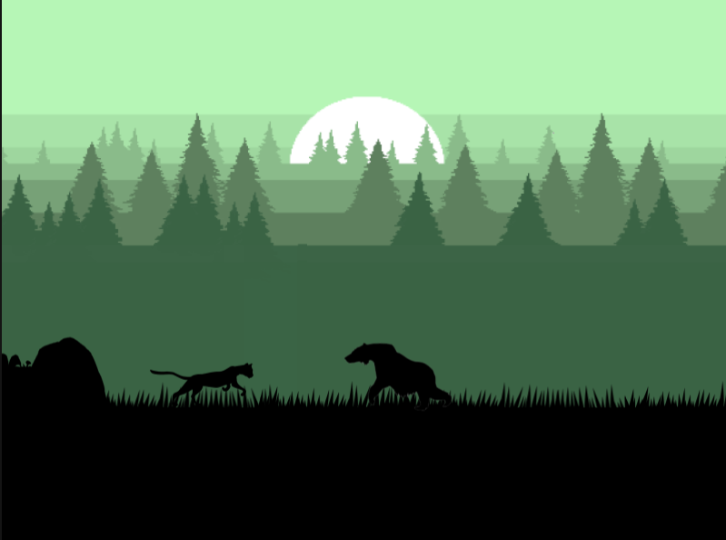
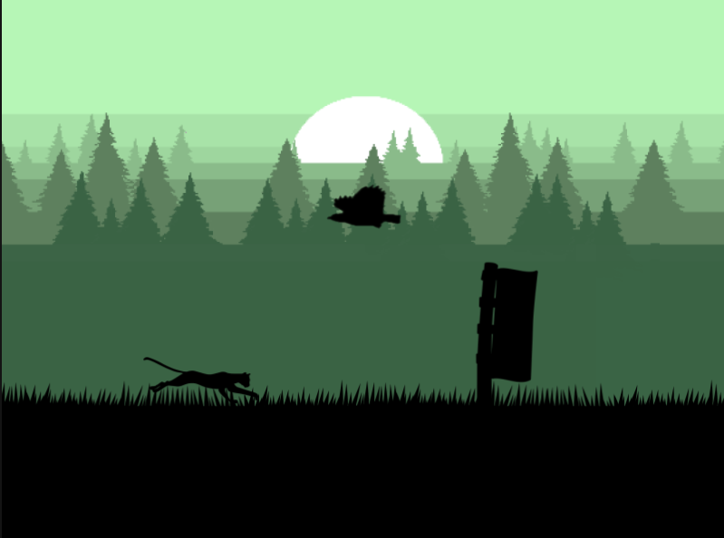

# Hi

I'm Nicolas and I'm a 5th year student at Epitech.  
My strengths are OOP, C++ programming and software development.  
I'm also a Roblox developer during my free time.  
  
  
### Technologies I'm most familiar with :
- C/C++, CMake, Git, Python, Luau, TypeScript

### Programming concepts I most commonly use :
- OOP, MVC (MVVM), ECS

### Web basics that I've learned :
- Django, HTML/CSS, JavaScript (Node.js and React briefly)

### Other random things that peak my interest :
- 3D graphics, raytracing
  
  
## Check out some of my projects :

Raytracer | Myworld | Webapp prototype | Myrunner
--- | --- | --- | ---
  |   |  |  

- [Raytracer](https://github.com/awisemanoncesaid/Raytracer) - C++, CMake
- [MyWorld (WIP)](https://github.com/awisemanoncesaid/MyWorld) - C++, CMake
- [Game engine library](https://github.com/awisemanoncesaid/ECS) - C++, CMake
- [Webapp prototype](https://github.com/awisemanoncesaid/webapp-prototype) - Python Django, HTML/CSS, JavaScript
- [Board game bot(WIP)](https://github.com/awisemanoncesaid/board-game-bot) - C++, CMake
- [JSON parser](https://github.com/awisemanoncesaid/ma-lib) - C, Makefile
- [Command line parser](https://github.com/awisemanoncesaid/command-line-parser) - C, Makefile
- [My runner](https://github.com/awisemanoncesaid/my-c-runner) - C, Makefile
